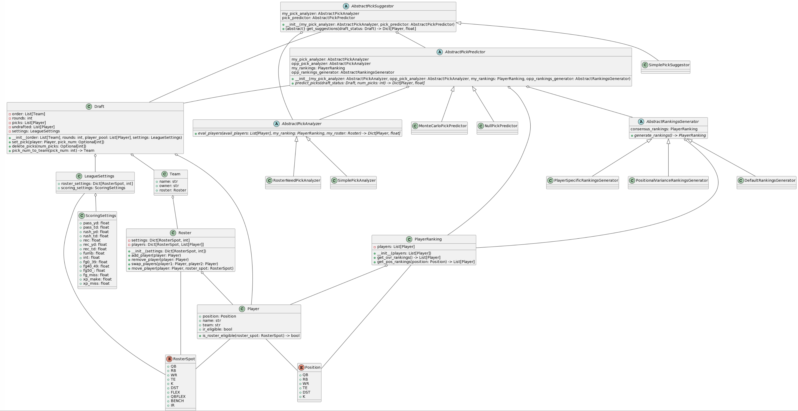

# ff_toolbox
UI and backend to help with fantasy football live drafting, trade analysis, and more.

Development is still underway, and this document will be updated as more features are implemented.

# Usage
Eventually, this tool will have the following users
- UI for Common User
- Model Playground for Data Analysts

## UI
(please come back later, writing models and API frameworks for other developers is more fun than UIs ;))

## Model Playground
There are many factors playing into the value of a player. How do you project their performance?
In a draft, how should you value a player when roster is a consideration? How do you predict picks and use that to help determine when might be the best time to go after or wait for players?
This Python API allows exploration of all of those questions through 4 model types that can be implemented.

### Rankings Generator
```python
consensus_rankings: PlayerRanking
generate_rankings() -> PlayerRanking
```
Every team values players differently, and this lets you model that behavior. This is most useful for generating opponent rankings to assist in something like Monte Carlo pick prediction.
Do you want opponents to use site-provided rankings every time? Maybe with slight variation? Do you think they're more savvy and generally follow the same distribution as a bunch of experts?
By leaving the choice of deterministic vs varying opponent rankings to the algorithm implemented here, possibilities for creative usage in pick prediction are boundless.

However, this can also be used to generate complicated player projection algorithms to use for your own team or to easily re-rank players in the preseason as news comes out.

### Pick Analyzer
```python
eval_players(avail_players: list[Player], my_ranking: PlayerRanking, my_roster: Roster, settings: LeagueSettings) -> dict[Player, float]
```
You know how you value players, you know your current drafted roster, and you know how your league operates. Given all that, how should you value all remaining players in a vacuum (ignoring for now whether you think players will be available)?
Basically, if this were your last pick and you had to pound the table to get a player, what value do you assign to each player?
There are a wide range of modeling possibilities here. Do you simply calculate VOR and call it a day? Do you take roster setting into account to model projected points added *to your team specifically*?
This base interface leaves it up to you to play with that

### Pick Predictor
```python
my_pick_analyzer: AbstractPickAnalyzer
opp_pick_analyzer: AbstractPickAnalyzer
my_rankings: PlayerRanking
opp_rankings_generator: AbstractRankingsGenerator
predict_picks(draft_status: Draft, num_picks: int) -> dict[Player, float]
```
Should you wait a round to take a player who you like a lot but many people don't? It's the question that plagues all drafters.
To answer, you must at least know: what's the probability that player will be available *x* picks in the future?
This model interface allows you to do that, spitting out % chance every player will be available at that pick.
Do you run a number of Monte Carlo simulations, generating new opponent rankings every time to simulate a real draft?
Do you try and deterministically calculate that probability based on expected ranking distribution?
Do you care about performance of this algorithm to complete within your allotted draft time?
It's all up to you when you implement this interface!

### Pick Suggestor
```python
my_pick_analyzer: AbstractPickAnalyzer
pick_predictor: AbstractPickPredictor
get_suggestions(draft_status: Draft) -> Dict[Player, float]
```
Now you can really answer the question: what player do you take in the context of the draft?
You have a way to value players in a vacuum and a way to calculate probability of availability at any draft slot.
So, do you run a bunch of pick predictors, optimizing your strategy for all your remaining picks?
Do you assume market value will reset in 2 rounds and just rely on pick prediction for those two rounds?
Or do you ignore pick prediction altogether, believing you always get your guy, even if you need to reach?
By implementing this interface, you can choose to value players how you want.

### Overall Usage
Currently, draft status must be updated manually with an external program, but that will change soon! Integrations will come out to improve the draft tracking experience.

Once that is implemented, however, you merely need to instantiate a `PickSuggestor`, feed draft status in every time your pick comes up, and watch the player suggestions roll in like magic!
Because it is so easy to change models, you can play around with mock drafts beforehand, or even use a Ranking Generator to create your own league-tailored mock drafts.
Possibilities for usage of this framework are endless.

## Software Design
The following UML shows the design of the backend model of the ff_toolbox. Front-end application and further non-core features will be filled out as they are developed.
However, these are the core components necessary to do anything, including future integration beyond drafting, including trade analysis, trade suggesting, etc.

